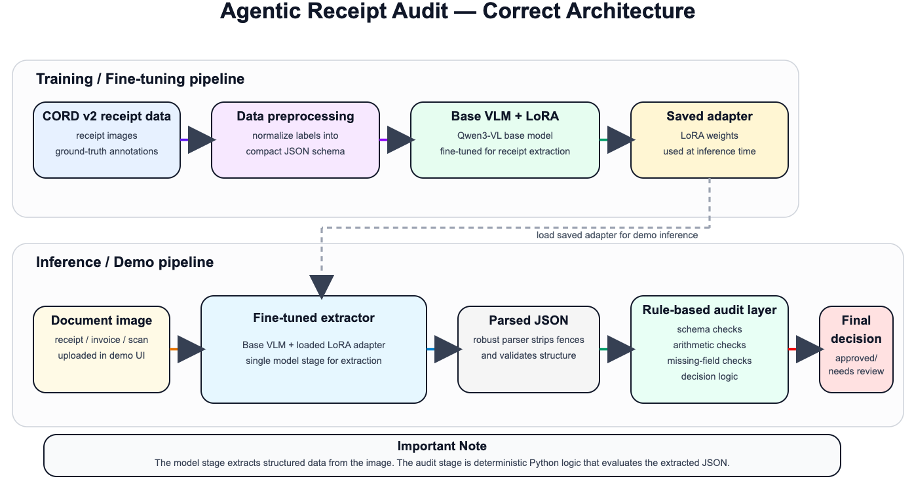
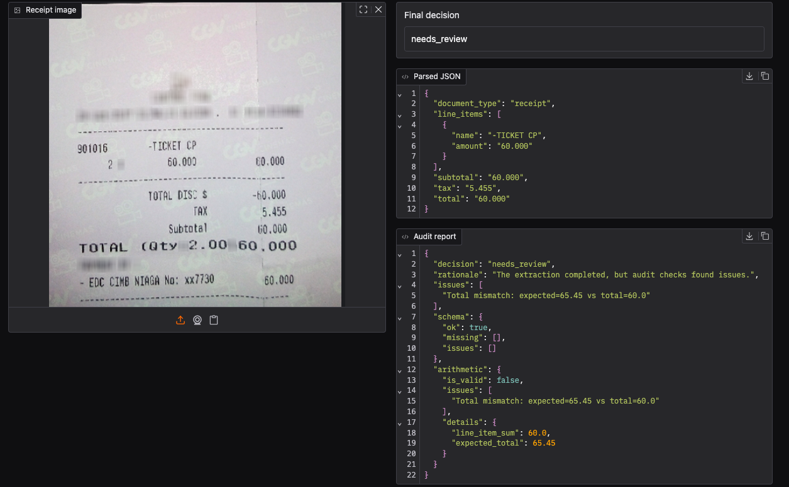

# Agentic Receipt Audit

A GitHub-ready version of the receipt audit project: a fine-tuned vision-language receipt extractor that produces structured JSON and runs audit checks before returning a final decision.

## What this project does

Given a receipt image, the system:

- extracts a compact JSON schema using a Qwen3-VL adapter
- parses the model output robustly, even if it includes fences or extra text
- checks arithmetic consistency across line items, subtotal, tax, and total
- returns a final decision:
  - `approved`
  - `needs_review`

This repo is structured so it can run locally **or** be deployed to Hugging Face Spaces.

## Architecture



## Repository structure

```text
agentic-receipt-audit-github/
├── app.py
├── pyproject.toml
├── requirements.txt
├── README.md
├── notebooks/
│   └── fixed_receipt_audit.ipynb
├── examples/
└── src/
    └── receipt_audit/
        ├── __init__.py
        ├── audit.py
        ├── cli.py
        ├── config.py
        ├── modeling.py
        ├── parsing.py
        ├── prompts.py
        ├── schemas.py
        └── ui.py
```

## Base model and data

- Base model: `Qwen/Qwen3-VL-4B-Instruct` or the exact base model you trained on
- Fine-tuning: PEFT / LoRA
- Dataset used in the notebook: `naver-clova-ix/cord-v2`
- Training environment: Kaggle GPU
- Deployment target: local Gradio or Hugging Face Spaces

## Minimal extraction schema

```json
{
  "document_type": "receipt",
  "line_items": [
    {
      "name": "",
      "amount": ""
    }
  ],
  "subtotal": "",
  "tax": "",
  "total": ""
}
```

## Setup

### 1) Install dependencies

```bash
pip install -r requirements.txt
```

Or install as a package:

```bash
pip install -e .
```

### 2) Choose how to load the adapter

You can load the fine-tuned adapter either:

- from a **local path** downloaded from Kaggle, or
- from a **Hugging Face model repo**

Set these environment variables:

```bash
export RECEIPT_AUDIT_BASE_MODEL="Qwen/Qwen3-VL-4B-Instruct"
export RECEIPT_AUDIT_ADAPTER="Monish-K/qwen-3-vl-4b-instruct-lora-cord-v2"
```

For a local adapter directory:

```bash
export RECEIPT_AUDIT_ADAPTER="./adapter"
```

The base model must match the one used when training the adapter.

## Run locally

### Option A: root app entrypoint

```bash
python app.py
```

### Option B: module entrypoint

```bash
python -m receipt_audit.cli
```

By default the app launches on port `7860`.

## Hugging Face Spaces

This repo is also 'Spaces-friendly', so the adapter need to be downloaded from hugginface - Monish-K/qwen-3-vl-4b-instruct-lora-cord-v2

## Example


